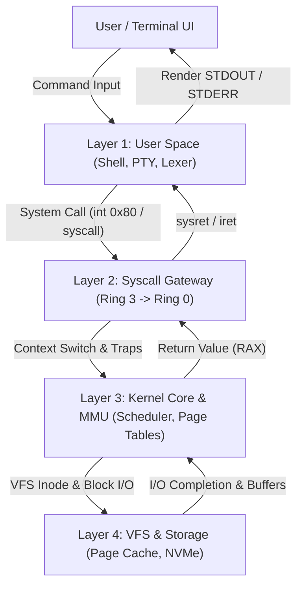

# 3D Linux Terminal Internals — System Architecture

This document details the architectural design and visualization model of the 3D Linux Terminal Internals Visualizer.

## 1. Core Architectural Layers

### Layer 1: User Space & Shell
- **PTY (Pseudoterminal)**: Simulates the master/slave PTY pair connecting keyboard input to terminal line discipline.
- **Line Discipline**: Manages canonical mode, character echoing, line editing, and signal generation (`Ctrl+C` -> `SIGINT`).
- **Lexer & Parser**: Breaks input commands into tokens, parses syntax trees (pipes, redirections, variables), and resolves binary paths via `$PATH` hashing.

### Layer 2: Syscall Gateway (Privilege Transition)
- **Ring Boundary**: Visualizes the hardware boundary separating unprivileged Ring 3 (User) and privileged Ring 0 (Supervisor).
- **Syscall Dispatcher**: Simulates the system call vector table (`sys_call_table`), mapping numbers to handler routines.
- **File Descriptors**: Maintains process-level tables mapping integers (`0: stdin`, `1: stdout`, `2: stderr`) to file objects.

### Layer 3: Kernel Core & Memory Management Unit (MMU)
- **CFS Scheduler**: Completely Fair Scheduler organizing runnable tasks in a red-black tree indexed by `vruntime`.
- **4-Level Page Tables**: Visualizes Virtual-to-Physical translation: PGD -> P4D -> PUD -> PMD -> PTE.
- **ELF Segment Mapping**: Simulates process virtual address spaces (`.text`, `.rodata`, `.data`, `.bss`, heap, memory maps, stack).

### Layer 4: Virtual File System (VFS) & Storage Grid
- **Dentry & Inode Cache**: In-memory directory entry tree pointing to metadata inodes.
- **Page Cache**: Caches 4KB disk blocks in physical RAM to accelerate sequential and random I/O.
- **Block I/O & NVMe DMA**: Direct Memory Access controllers servicing non-cached I/O from physical storage arrays.
